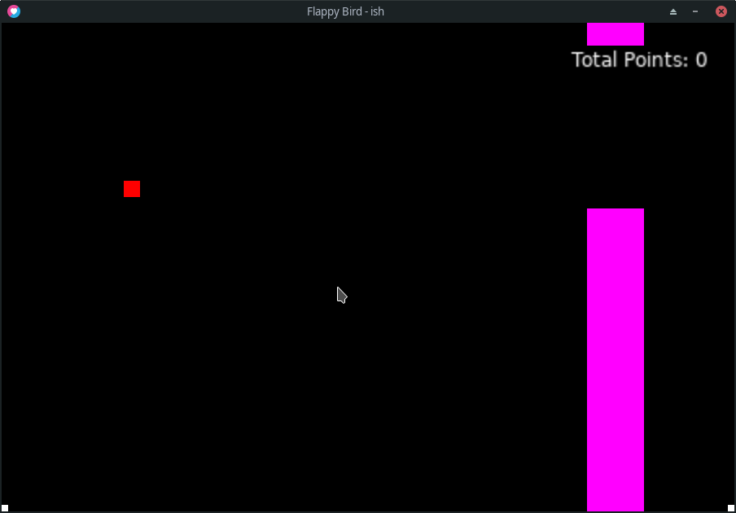

# Lua-bird

 

A simple flappy bird clone made for learning the language. Made with [love2d](https://love2d.org/).



## Install

Love2D is required to run the game. You can install it [here](https://love2d.org/).

```sh
$ git clone https://github.com/Cyan903/Lua-bird.git
$ cd Lua-bird
$ love .
```
